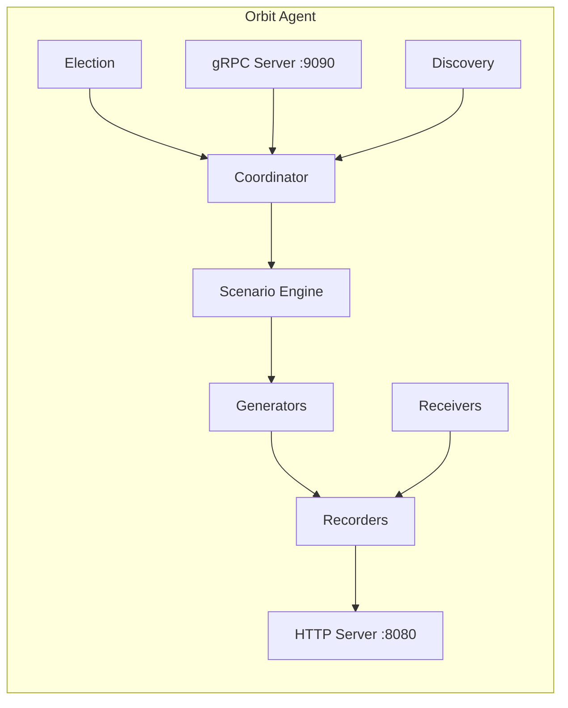
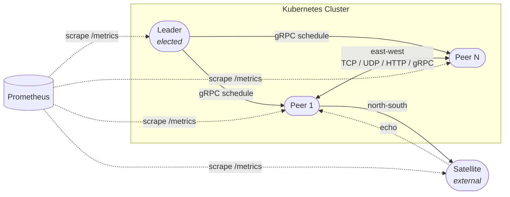

# Orbit

Kubernetes network load generator and measurement tool for validating network monitoring.

Orbit generates controlled traffic flows between pods (east-west) and external endpoints (north-south), independently measures them at application, wire, and system layers, and exposes all metrics via Prometheus — providing ground-truth data to validate tooling accuracy.

## Features

- **Traffic Generation** — TCP streams, UDP streams, HTTP requests, gRPC calls, ICMP pings, connection churn
- **Three-Layer Measurement** — Application-level byte/packet counters, wire-level TCP_INFO stats, system-level `/proc` metrics
- **Peer Discovery** — Automatic discovery via Kubernetes EndpointSlice API
- **Leader Election** — Kubernetes Lease-based election; leader coordinates traffic across all peers
- **Scenario Engine** — YAML-driven traffic profiles and active scenario selection loaded from ConfigMap with hot-reload via fsnotify
- **Satellite Mode** — Run an Orbit instance outside the cluster as a controlled external endpoint
- **Authentication** — Shared bearer token protecting all HTTP, gRPC, and raw TCP/UDP receiver endpoints
- **Checksum Verification** — SHA-256 payload integrity checks across HTTP and gRPC flows
- **Prometheus Metrics** — All measurements exposed at `/metrics` with a pre-built Grafana dashboard
- **Helm Chart** — DaemonSet or Deployment, RBAC, ServiceMonitor, PodDisruptionBudget, Satellite

## Quick Start

### Build

```bash
make build-local    # binary for current OS
make docker-build   # container image (current arch)
make docker-release # multi-arch image (amd64 + arm64) with SBOM & attestations
```

Run `make help` to see all available targets.

### Deploy with Helm

```bash
helm install orbit deploy/helm/orbit \
  --namespace orbit --create-namespace \
  --set auth.token="my-secret-token" \
  --set config.activeScenario="steady-low"
```

### Run Locally (development)

```bash
export ORBIT_AUTH_TOKEN=dev-token
export ORBIT_POD_NAME=local
./bin/orbit --mode=standalone --http-port=8080 --grpc-port=9090
```

### Version

```bash
./bin/orbit --version
# orbit version 0.1.0
```

The `orbit_build_info` Prometheus metric exposes `version` and `commit` labels at runtime.

## Architecture



### Data Flow



## Configuration

All flags can also be set via environment variable (prefix `ORBIT_`, uppercase, hyphens become underscores).

| Flag | Env Var | Default | Description |
|------|---------|---------|-------------|
| `--mode` | `ORBIT_MODE` | `cluster` | `cluster`, `satellite`, or `standalone` |
| `--pod-name` | `ORBIT_POD_NAME` | — | Pod name (usually from Downward API) |
| `--namespace` | `ORBIT_NAMESPACE` | — | Kubernetes namespace (defaults to Downward API) |
| `--node-name` | `ORBIT_NODE_NAME` | — | Node name (from Downward API) |
| `--zone` | `ORBIT_ZONE` | — | Topology zone |
| `--http-port` | `ORBIT_HTTP_PORT` | `8080` | HTTP server port |
| `--grpc-port` | `ORBIT_GRPC_PORT` | `9090` | gRPC server port |
| `--tcp-receiver-port-start` | `ORBIT_TCP_RECEIVER_PORT_START` | `10000` | TCP receiver starting port |
| `--udp-receiver-port-start` | `ORBIT_UDP_RECEIVER_PORT_START` | `11000` | UDP receiver starting port |
| `--auth-token` | `ORBIT_AUTH_TOKEN` | — | **Required.** Shared authentication token |
| `--service-name` | `ORBIT_SERVICE_NAME` | `orbit` | Headless service name for peer discovery |
| `--probe-interval` | `ORBIT_PROBE_INTERVAL` | `10s` | Default probe interval |
| `--discovery-period` | `ORBIT_DISCOVERY_PERIOD` | `5s` | Peer discovery refresh period |
| `--leader-election-id` | `ORBIT_LEADER_ELECTION_ID` | `orbit-leader` | Leader election Lease name |
| `--leader-election-namespace` | `ORBIT_LEADER_ELECTION_NAMESPACE` | — | Leader election namespace (defaults to Downward API) |
| `--log-level` | `ORBIT_LOG_LEVEL` | `info` | `debug`, `info`, `warn`, `error` |
| `--log-format` | `ORBIT_LOG_FORMAT` | `json` | `json` or `text` |
| `--scenarios-config-path` | — | `/etc/orbit/scenarios.yaml` | Path to scenarios YAML file |
| ~~`--active-scenario`~~ | — | — | *Removed.* Set `activeScenario` in scenarios ConfigMap instead |
| `--metrics-protected` | `ORBIT_METRICS_PROTECTED` | `false` | Require auth token for `/metrics` |
| `--schedule-lease-ttl` | `ORBIT_SCHEDULE_LEASE_TTL` | `30s` | Peer stops generators if no heartbeat received within this duration |
| `--heartbeat-interval` | `ORBIT_HEARTBEAT_INTERVAL` | `10s` | Leader sends schedule heartbeats to peers at this interval |

## Scenarios

Scenarios are defined in `values.yaml` under `scenarios:` and mounted as a ConfigMap. The file is watched via fsnotify — changes to both scenario definitions and the active scenario are picked up automatically without restarting pods.

The active scenario is set via `config.activeScenario` in your Helm values. To switch scenarios at runtime:

```bash
helm upgrade orbit deploy/helm/orbit --reuse-values \
  --set config.activeScenario="connection-churn"
```

Kubernetes propagates the ConfigMap update to all pods (~60s), and the leader automatically stops existing flows and activates the new scenario.

### Schedule Lease

The leader periodically heartbeats the current schedule to all peers (default every `10s`). Each peer tracks the last heartbeat time and enforces a lease TTL (default `30s`). If a peer loses contact with the leader — due to a network partition, leader crash, or leadership change — its lease expires and generators are stopped automatically. This prevents orphaned traffic flows from running indefinitely.

```bash
helm upgrade orbit deploy/helm/orbit --reuse-values \
  --set config.scheduleLeaseTTL="30s" \
  --set config.heartbeatInterval="10s"
```

Heartbeats are idempotent: peers recognize repeated schedules by `runID` and refresh their lease without restarting generators.

Before distributing schedules, the leader waits for the peer mesh to stabilize — the discovered peer count must remain unchanged for `config.stabilizationPeriod` (default `10s`). This prevents partial mesh assignments when pods are still joining. Adjust it for larger clusters:

```bash
helm upgrade orbit deploy/helm/orbit --reuse-values \
  --set config.stabilizationPeriod="30s"
```

```yaml
scenarios:
  steady-low:
    description: "Low sustained load"
    eastWest:
      - type: tcp-stream
        bandwidthMbps: 10
        payloadBytes: 1400
      - type: http
        rps: 10
        payloadBytes: 512
    northSouth: []

  connection-churn:
    description: "Rapid connection lifecycle"
    eastWest:
      - type: connection-churn
        connectionsPerSecond: 500
        holdDurationMs: 50
    northSouth: []
```

### Flow Types

| Type | Key Parameters |
|------|---------------|
| `tcp-stream` | `bandwidthMbps`, `payloadBytes`, `connections` |
| `udp-stream` | `packetRate`, `packetSize` |
| `http` | `rps`, `payloadBytes`, `httpMethod`, `keepAlive` |
| `grpc` | `rps`, `payloadBytes` |
| `icmp` | `intervalMs`, `packetSize` |
| `connection-churn` | `connectionsPerSecond`, `holdDurationMs` |

### Satellites

Satellites are external Orbit instances (typically running via Docker Compose) that act as controlled north-south endpoints. Register them under `northSouth.satellites` in your Helm values — you only need to specify the host once and the target URLs are resolved automatically from well-known ports:

```yaml
northSouth:
  satellites:
    - name: satellite-01
      host: "10.0.0.50"
      # ports default to 8080/9090/10000/11000 — override if needed
      # authToken: ""    # defaults to the cluster's auth.token
      flows:
        - type: http
          rps: 50
          payloadBytes: 1024
        - type: tcp-stream
          bandwidthMbps: 10
          payloadBytes: 1400
```

Satellite flows are started automatically whenever any scenario is activated. They are merged with the scenario's own `northSouth` flows and appear in Prometheus metrics with `direction="north-south"`. Each satellite can optionally override the cluster auth token via `authToken`.

To collect the satellite's own metrics (receiver-side bytes, active connections, checksum errors), enable `serviceMonitor.satelliteServiceMonitor.enabled` — see [Helm Values](#helm-values) below.

To run a satellite outside the cluster, see `deploy/compose/README.md`.

## Endpoints

| Path | Method | Auth | Description |
|------|--------|------|-------------|
| `/healthz` | GET | No | Liveness probe |
| `/readyz` | GET | No | Readiness probe |
| `/metrics` | GET | Optional | Prometheus metrics (auth via `--metrics-protected`) |
| `/status` | GET | Yes | Agent status JSON (pod, mode, leader, peers, scenario, uptime) |

## Prometheus Metrics

### Build Info
| Metric | Type | Description |
|--------|------|-------------|
| `orbit_build_info` | gauge | Build version and commit (labels: `version`, `commit`) |

### Cluster
| Metric | Type | Description |
|--------|------|-------------|
| `orbit_peer_count` | gauge | Number of discovered peers |
| `orbit_leader_info` | gauge | Whether this instance is the leader (label: `instance`) |
| `orbit_scenario_active` | gauge | Currently active scenario (labels: `scenario`, `run_id`) |

### Application Layer
| Metric | Type | Labels | Description |
|--------|------|--------|-------------|
| `orbit_app_bytes_sent_total` | counter | scenario, run_id, flow_type, protocol, source, target, direction | Bytes written to sockets |
| `orbit_app_bytes_received_total` | counter | scenario, run_id, flow_type, protocol, source, target, direction | Bytes read from sockets |
| `orbit_app_packets_sent_total` | counter | scenario, run_id, flow_type, protocol, source, target | UDP/ICMP packets sent |
| `orbit_app_packets_received_total` | counter | scenario, run_id, flow_type, protocol, source, target | UDP/ICMP packets received |
| `orbit_app_connections_total` | counter | scenario, run_id, flow_type, protocol, source, target | TCP/gRPC connections established |
| `orbit_app_connections_active` | gauge | scenario, run_id, flow_type, protocol, source, target | Currently open connections |
| `orbit_app_request_duration_seconds` | histogram | scenario, run_id, flow_type, protocol, source, target | HTTP/gRPC round-trip latency |
| `orbit_app_throughput_bytes_per_second` | gauge | scenario, run_id, flow_type, protocol, source, target | Current measured throughput |
| `orbit_app_dns_resolution_seconds` | histogram | target, source | DNS lookup latency |
| `orbit_app_checksum_errors_total` | counter | flow_type, protocol, source, target | Payload checksum verification failures |

### Wire Layer (Linux only, TCP_INFO)

Wire-layer byte and segment counters require **Linux kernel 4.2+** for the extended `tcp_info` fields (`bytes_sent`, `bytes_received`, `bytes_retrans`, `segs_out`). On older kernels these counters report zero but all other TCP_INFO metrics (RTT, cwnd, MSS, etc.) still work.

| Metric | Type | Labels | Description |
|--------|------|--------|-------------|
| `orbit_wire_rtt_seconds` | gauge | source, target, protocol | Smoothed TCP round-trip time |
| `orbit_wire_rtt_variance_seconds` | gauge | source, target, protocol | TCP RTT variance |
| `orbit_wire_bytes_sent_total` | counter | source, target, protocol | Bytes sent (TCP_INFO) |
| `orbit_wire_bytes_received_total` | counter | source, target, protocol | Bytes received (TCP_INFO) |
| `orbit_wire_bytes_retransmitted_total` | counter | source, target, protocol | Retransmitted bytes |
| `orbit_wire_segments_sent_total` | counter | source, target, protocol | TCP segments sent |
| `orbit_wire_segments_retransmitted_total` | counter | source, target, protocol | TCP segments retransmitted |
| `orbit_wire_lost_packets_total` | counter | source, target, protocol | TCP lost segments |
| `orbit_wire_mss_bytes` | gauge | source, target, protocol | Max segment size |
| `orbit_wire_cwnd_segments` | gauge | source, target, protocol | Congestion window size |

### System Layer (Linux only, /proc)
| Metric | Type | Labels | Description |
|--------|------|--------|-------------|
| `orbit_node_tcp_active_opens_total` | counter | node | TCP active opens (`/proc/net/snmp`) |
| `orbit_node_tcp_passive_opens_total` | counter | node | TCP passive opens (`/proc/net/snmp`) |
| `orbit_node_ip_bytes_sent_total` | counter | node, interface | Interface TX bytes (`/proc/net/dev`) |
| `orbit_node_ip_bytes_received_total` | counter | node, interface | Interface RX bytes (`/proc/net/dev`) |
| `orbit_node_udp_datagrams_sent_total` | counter | node | UDP datagrams sent (`/proc/net/snmp`) |
| `orbit_node_udp_datagrams_received_total` | counter | node | UDP datagrams received (`/proc/net/snmp`) |

### Generator Metrics
| Metric | Type | Labels | Description |
|--------|------|--------|-------------|
| `orbit_generator_bytes_total` | counter | flow_type, source, target | Bytes generated |
| `orbit_generator_errors_total` | counter | flow_type, source, target | Generator errors |
| `orbit_generator_latency_seconds` | histogram | flow_type, source, target | Request latency |

### Receiver Metrics
| Metric | Type | Labels | Description |
|--------|------|--------|-------------|
| `orbit_receiver_bytes_total` | counter | receiver_type | Bytes received |
| `orbit_receiver_connections_total` | counter | receiver_type | Connections accepted |

## Observability

A pre-built Grafana dashboard is available at `deploy/grafana/orbit-dashboard.json`. Import it and select a Prometheus datasource.

Prometheus recording rules and alerting rules are at `deploy/prometheus/recording-rules.yaml`. Included alerts:

| Alert | Condition |
|-------|-----------|
| `OrbitHighRetransmitRate` | Retransmit rate > 10/s for 5m |
| `OrbitHighLatency` | p95 request latency > 1s for 5m |
| `OrbitGeneratorErrors` | Generator error rate > 1/s for 2m |
| `OrbitNoPeers` | Peer count = 0 for 5m |
| `OrbitChecksumErrors` | Any checksum failures in 5m window |

## Helm Values

See `deploy/helm/orbit/values.yaml` for all configurable values. Key options:

- `mode` — `daemonset` (one per node) or `deployment` (replica count)
- `auth.token` / `auth.existingSecret` — Bearer token configuration
- `config.activeScenario` — Active scenario (set in ConfigMap, hot-reloaded without restart)
- `config.stabilizationPeriod` — Time the peer mesh must be stable before distributing schedules (default `10s`)
- `config.scheduleLeaseTTL` — Peer stops generators if no leader heartbeat received within this duration (default `30s`)
- `config.heartbeatInterval` — Leader sends schedule heartbeats to peers at this interval (default `10s`)
- `northSouth.satellites` — Register external satellite endpoints with their traffic flows (hot-reloaded)
- `serviceMonitor.enabled` — Create Prometheus ServiceMonitor for orbit pods
- `serviceMonitor.satelliteServiceMonitor.enabled` — Create ServiceMonitor + headless Service + Endpoints for external satellites (IPs sourced from `northSouth.satellites[].host`). Supports `labels` and `annotations` for Prometheus Operator discovery
- `satellite.enabled` — Deploy a satellite instance inside the cluster
- `securityContext.capabilities.add: [NET_RAW]` — Required for ICMP

## Make Targets

| Target | Description |
|--------|-------------|
| `make help` | Show all targets (default) |
| `make build` | Build linux binary |
| `make build-local` | Build binary for current OS |
| `make test` | Run all tests with race detector |
| `make proto` | Regenerate protobuf code |
| `make tidy` | Run `go mod tidy` |
| `make docker-build` | Build Docker image (current arch) |
| `make docker-release` | Multi-arch build + push with SBOM & attestations |
| `make helm-lint` | Lint Helm chart |
| `make helm-template` | Render Helm templates locally |
| `make clean` | Remove build artifacts |

## Project Structure

```
orbit/
├── cmd/orbit/main.go              # Entrypoint, version/commit injection
├── internal/
│   ├── agent/                      # Agent orchestration, mode dispatch
│   ├── auth/                       # Token validation, HTTP/gRPC middleware
│   ├── checksum/                   # SHA-256 payload integrity verification
│   ├── config/                     # Configuration loading (flags, env, file)
│   ├── coordinator/                # Leader → peer schedule distribution
│   ├── discovery/                  # Peer discovery via headless service
│   ├── election/                   # Kubernetes Lease-based leader election
│   ├── generator/                  # Traffic generators (TCP, UDP, HTTP, gRPC, ICMP, Churn)
│   ├── metrics/                    # Prometheus metric definitions
│   ├── receiver/                   # Traffic receivers (TCP, UDP, HTTP, gRPC)
│   ├── recorder/                   # Measurement recorders (App, Wire, System)
│   ├── scenario/                   # Scenario engine + fsnotify config watcher
│   └── server/                     # HTTP & gRPC servers
├── proto/orbit/v1/                 # Protobuf service & message definitions
├── deploy/
│   ├── compose/                    # Docker Compose for external satellite
│   ├── helm/orbit/                 # Helm chart (DaemonSet, Deployment, Satellite)
│   ├── grafana/                    # Grafana dashboard JSON
│   └── prometheus/                 # Recording rules & alerting rules
├── Dockerfile                      # Multi-arch build (amd64 + arm64)
├── Makefile                        # Build, test, release targets
├── VERSION                         # Semantic version (read by Makefile)
├── LICENSE                         # Apache-2.0
└── go.mod
```

## Operational Notes

### Prometheus Cardinality (run_id label)

Several high-cardinality metrics (`orbit_app_bytes_sent_total`, `orbit_app_bytes_received_total`, `orbit_app_connections_total`, etc.) carry a `run_id` label. Each scenario activation generates a new timestamp-based `run_id` (e.g. `steady-low-1712345678901`), creating a permanently new set of Prometheus timeseries.

In long-running deployments with frequent scenario activations, this causes unbounded timeseries growth in the Prometheus TSDB, which can eventually lead to OOM or degraded query performance.

Recommended mitigations:

- **Set a short TSDB retention window** — `--storage.tsdb.retention.time=7d` (or match your alerting lookback window). Old `run_id` timeseries will be evicted after retention expires.
- **Tune `--query.max-samples`** — The default (`50000000`) may be hit by range queries over many `run_id` values. Raise or lower based on available RAM.
- **Limit scenario churn** — Avoid activating new scenarios more often than needed. Each activation creates a new `run_id`.
- **Use recording rules** — Pre-aggregate high-cardinality series in `deploy/prometheus/recording-rules.yaml` to reduce query-time cardinality.

## License

[Apache License 2.0](LICENSE)
